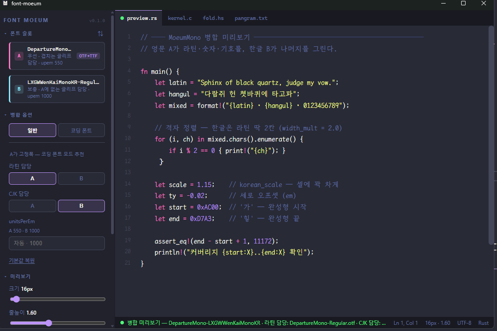
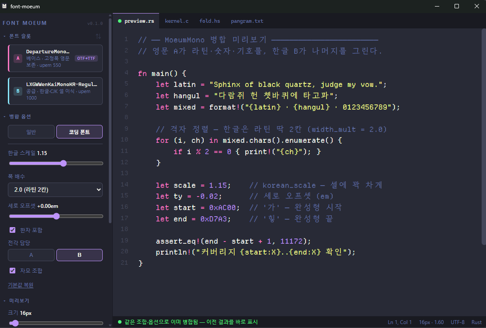
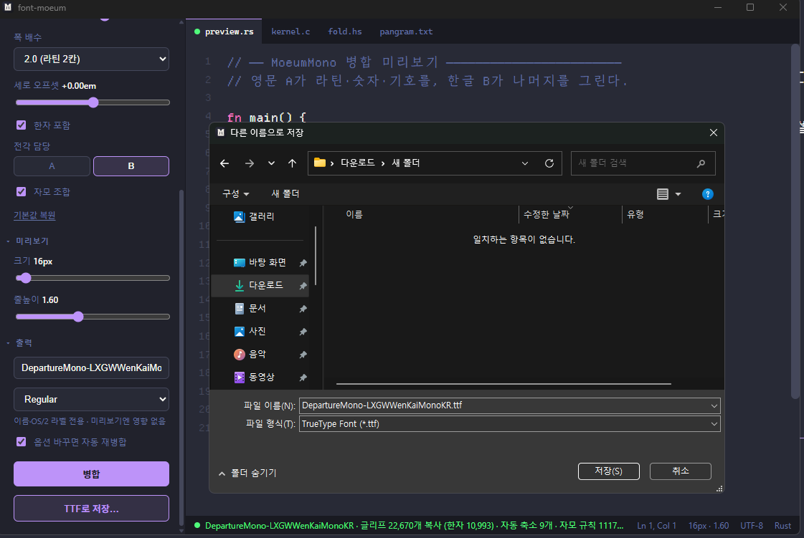

# font-moeum (모음)

영문 폰트 + 한글 폰트(TTF/OTF) 딱 두 개를 합치고, 그 결과를 그 자리에서 바로 타이핑해 확인하는 GUI 툴입니다.

*A tiny GUI tool that merges an English font and a Korean font into one TTF — with instant live preview.*

[](LICENSE)
[](https://github.com/johndoekim/font-moeum/releases)

<!-- 캡처 후 주석 해제:  -->
<!-- 캡처 가이드: ScreenToGif(Windows) 또는 LICEcap(macOS/Windows) 사용. 창 크기 1120×720(앱 기본 창 크기).
     시나리오(15~20초): 폰트 슬롯에 영문 폰트(A)·한글 폰트(B) 드래그 → 병합 →
     미리보기 영역에 타이핑 → 크기·줄높이 슬라이더 조정 → A/B 스왑 → "TTF로 저장…". -->

## 소개

영문 폰트(A)와 한글 폰트(B)를 하나의 TTF로 합칩니다. 겹치는 라틴·숫자·문장부호는 지정한 쪽이 이기고, 나머지는 서로의 글리프로 채워집니다.

CLI로 폰트를 합치는 것 자체는 어렵지 않습니다. 어려운 건 "합쳐봤더니 어색해서 다시 조정"을 반복하는 루프입니다. font-moeum은 이 루프를 몇 분에서 몇 초로 줄이는 데 집중합니다 — 병합 결과가 나오자마자 화면에서 바로 타이핑해 확인할 수 있고, 옵션을 바꾸면 자동으로 재병합됩니다.

핵심 기능:
- **즉시 미리보기** — FontFace API로 병합 결과를 바로 로드. 크기·줄높이는 재병합 없이 CSS로 0ms 실시간 조정
- **A/B 스왑** — 겹치는 글리프를 누가 가질지 한 번의 클릭으로 뒤집어 비교
- **코딩 폰트 모드** — 한글을 라틴 고정폭 셀(기본 2:1)에 맞춰 정렬. 한글 스케일·폭 배수·세로 오프셋 등을 고급 패널에서 조정
- **OTF 입력 지원** — 정적 OTF(CFF)를 업로드하면 내부적으로 TTF로 변환해 병합
- **출력 이름 자동 생성** — 두 폰트의 이름을 조합해 출력 패밀리 이름을 자동으로 채움(직접 수정 가능)

## 지원 범위

| 구분 | 내용 |
|---|---|
| 입력 형식 | TTF, 정적 OTF(CFF) |
| OTF 입력 시 | 로드 시점에 cu2qu로 TTF 변환 — 곡선 근사·CFF 힌팅 소실이 있으며, 슬롯에 "OTF→TTF" 배지로 표시됨 |
| 가변 폰트 | CFF2(가변 OTF)는 거부 |
| 출력 형식 | 항상 TTF |
| 폰트 개수 | 정확히 2개 — 라틴 담당(A) + CJK 담당(B) |

## 설치

[Releases](https://github.com/johndoekim/font-moeum/releases)에서 플랫폼에 맞는 바이너리를 받으세요.

- **Windows** — 두 가지 형태로 제공합니다.
  - **설치 파일** — `font-moeum_x.x.x_x64-setup.exe`(NSIS) 또는 `.msi`를 실행해 설치합니다.
  - **무설치(포터블)** — `font-moeum_x.x.x_x64-portable.zip`을 받아 압축을 풀고 `font-moeum.exe`를 더블클릭합니다. 같은 폴더의 `sidecar.exe`(폰트 병합 엔진)는 앱이 자동으로 실행하니 직접 열 필요는 없지만, 두 파일은 **같은 폴더에 함께** 있어야 합니다. WebView2 런타임이 필요하며 Windows 11·최신 Windows 10에는 기본 탑재돼 있습니다.
  - 코드 서명이 없어 두 방식 모두 SmartScreen이 실행을 막을 수 있습니다. "추가 정보" → "실행"을 눌러 진행하세요.
- **macOS** — 공증(notarization)이 없어 Gatekeeper가 앱을 막습니다. 터미널에서 `xattr -cr /Applications/font-moeum.app` 실행 후 여세요. Apple Silicon 빌드만 제공하며, Intel Mac은 아래 "소스에서 빌드"를 따라주세요.
- **Linux** — AppImage 또는 deb 패키지를 제공합니다.

## 사용법

1. **폰트 슬롯**에 영문 폰트(A)와 한글 폰트(B)를 각각 드래그하거나 클릭해서 올립니다 (TTF/OTF).
2. **병합 옵션**에서 모드를 고릅니다 — "일반"(기본) 또는 "코딩 폰트". 일반 모드에서는 "라틴 담당"·"CJK 담당"으로 겹치는 글리프를 누가 가질지 정합니다.
3. **병합** 버튼을 누르면 몇 초 안에 결과가 만들어지고, 미리보기 영역에서 바로 타이핑해 확인할 수 있습니다.
4. **미리보기** 섹션의 크기·줄높이 슬라이더로 즉시 조정합니다(재병합 없음).
5. 사이드바 상단의 **A/B 스왑**(⇅) 버튼으로 라틴 우선권을 뒤집어 비교할 수 있습니다.
6. **출력** 섹션에서 이름(자동으로 채워짐, 직접 수정 가능)과 스타일 라벨을 확인하고 **TTF로 저장…**으로 내보냅니다.

<!-- 캡처 후 주석 해제:  -->
<!-- 캡처 가이드: 일반 모드에서 A·B 폰트 로드 완료 + 병합 결과가 미리보기에 표시된 상태.
     사이드바의 "라틴 담당"/"CJK 담당" 세그먼트가 보이게. -->

<!-- 캡처 후 주석 해제:  -->
<!-- 캡처 가이드: 코딩 폰트 모드에서 고급 패널(한글 스케일·폭 배수·세로 오프셋 등) 펼친 상태 +
     고정폭 정렬된 미리보기(코드 샘플 탭 권장). -->

<!-- 캡처 후 주석 해제:  -->
<!-- 캡처 가이드: "출력" 섹션(이름 입력·스타일 드롭다운·"TTF로 저장…" 버튼)이 보이는 상태.
     저장 파일 다이얼로그가 함께 보이면 더 좋음. -->

## 병합 모드

**일반 모드**는 fontTools `Merger`로 A·B 전체를 합칩니다. 한글이 원본 비율 그대로 들어가므로 문서·UI용 폰트에 적합합니다. "라틴 담당"으로 겹치는 라틴·숫자·문장부호를 가질 폰트를, "CJK 담당"으로 겹치는 한글·한자·전각을 가질 폰트를 각각 고를 수 있습니다.

**코딩 폰트 모드**는 `scripts/fitmerge.py` 전용 엔진으로, 고정폭 A를 베이스로 열고 B의 한글 글리프를 라틴 폭의 정수배 셀(기본 2배)에 맞춰 스케일·중앙정렬해 복사합니다. 터미널·에디터처럼 라틴과 한글이 정확히 2:1로 정렬돼야 하는 코딩 폰트에 적합하며, A가 고정폭이 아니면 병합이 거부됩니다. 고급 패널에서 한글 스케일·폭 배수·세로 오프셋·한자 포함 여부·전각 담당·자모 조합(ccmp, 조합형 자모를 완성형 음절로 합성)을 조정할 수 있습니다.

## 소스에서 빌드

**요구 사항**
- Node 20+ / pnpm
- Rust stable (Tauri v2 요구사항)
- [uv](https://docs.astral.sh/uv/) (Python 3.13은 uv가 자동 설치)

**절차**

```sh
pnpm install
uv sync --directory scripts
pnpm build:sidecar   # 최초 1회 필수 — Tauri externalBin이 빌드 시 사이드카 바이너리 존재를 요구
pnpm tauri dev
# 또는
pnpm tauri build
```

**테스트**

```sh
uv run --directory scripts pytest -q   # Python 병합 엔진
pnpm test                              # 프론트
```

## 폰트 라이선스 주의

- 병합 대상 폰트의 라이선스 준수는 전적으로 사용자 책임입니다.
- OFL 폰트의 Reserved Font Name은 출력 이름에 재사용할 수 없습니다.
- 병합 결과물의 배포 가능 여부는 원본 두 폰트 라이선스의 교집합을 따릅니다.

## 크레딧

- [fontTools](https://github.com/fonttools/fonttools) — 병합 엔진
- 샘플 폰트: D2Coding · JetBrains Mono (OFL) — [sample/README.md](sample/README.md) 참고

## 라이선스

MIT ([LICENSE](LICENSE)). 앱 배포물(설치 파일)에는 폰트가 포함되지 않습니다.
